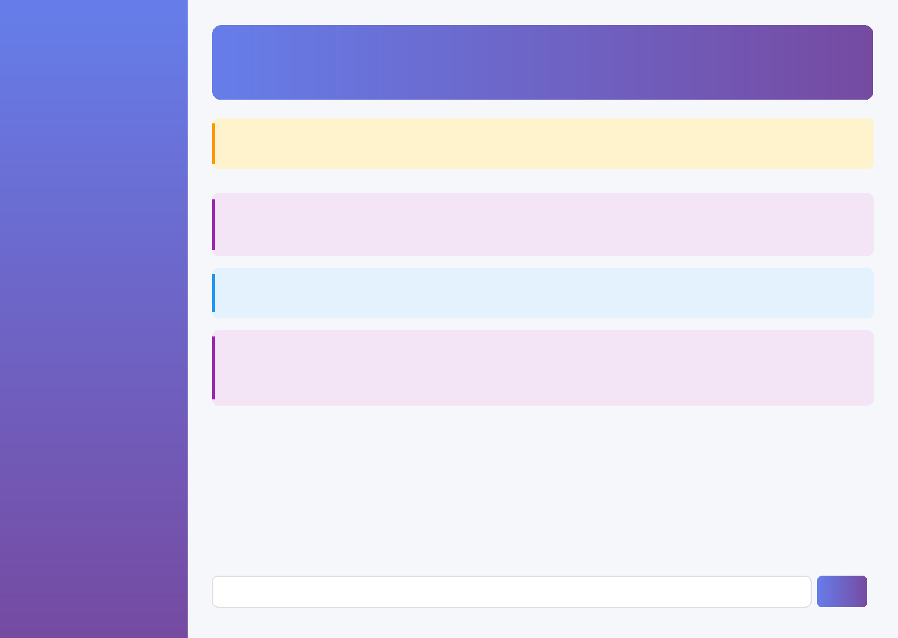

# Báo Cáo Kỹ Thuật - Đề Tài 6

## Xây Dựng Hệ Chuyên Gia Chẩn Đoán Đơn Giản

**Sinh viên thực hiện:** AnHgPham
**Ngày hoàn thành:** 03 tháng 11 năm 2025

---

## MỤC LỤC

1.  **Giới Thiệu Dự Án**
    1.1. Bối Cảnh
    1.2. Vấn Đề
    1.3. Giải Pháp: AI Medical Diagnosis System

2.  **Mục Tiêu & Yêu Cầu Đề Tài**
    2.1. Mục Tiêu
    2.2. Yêu Cầu

3.  **Phương Pháp Biểu Diễn Tri Thức**
    3.1. Lựa Chọn Phương Pháp: AI-Direct với LLM
    3.2. So Sánh Với Các Phương Pháp Truyền Thống
    3.3. Mô Tả Tập Tri Thức

4.  **Thiết Kế Cơ Chế Suy Luận**
    4.1. Kiến Trúc Suy Luận
    4.2. Prompt Engineering
    4.3. Xử Lý Khẩn Cấp

5.  **Xây Dựng Giao Diện Người Dùng (UI/UX)**
    5.1. Công Nghệ: Streamlit
    5.2. Thiết Kế Giao Diện
    5.3. Luồng Tương Tác

6.  **Kiểm Thử & Kết Quả Thực Nghiệm**
    6.1. Chiến Lược Kiểm Thử
    6.2. Các Loại Tests
    6.3. Kết Quả Thực Nghiệm

7.  **Sản Phẩm Bàn Giao**
    7.1. Mã Nguồn Chương Trình
    7.2. Tập Tri Thức & Dữ Liệu
    7.3. Báo Cáo Kỹ Thuật (Tài liệu này)
    7.4. Demo Hệ Thống Chẩn Đoán

8.  **Kết Luận & Hướng Phát Triển**
    8.1. Kết Luận
    8.2. Hướng Phát Triển

9.  **Tài Liệu Tham Khảo**

---

## 1. Giới Thiệu Dự Án

### 1.1. Bối Cảnh

Trong bối cảnh cuộc cách mạng công nghiệp 4.0, trí tuệ nhân tạo (AI) đang dần trở thành một công cụ mạnh mẽ, thay đổi sâu sắc nhiều lĩnh vực, và y tế không phải là ngoại lệ. Khả năng tiếp cận các dịch vụ y tế chất lượng vẫn là một thách thức lớn trên toàn cầu. Việc xây dựng các hệ thống thông minh có khả năng hỗ trợ chẩn đoán và tư vấn y tế từ xa mang lại tiềm năng to lớn trong việc democratize hóa dịch vụ chăm sóc sức khỏe.

### 1.2. Vấn Đề

-   **Khó tiếp cận:** Nhiều người, đặc biệt là ở các vùng nông thôn, vùng sâu vùng xa, gặp khó khăn trong việc tiếp cận các cơ sở y tế và bác sĩ chuyên khoa.
-   **Thiếu thông tin:** Người dân thường thiếu kiến thức y khoa cơ bản để tự nhận biết và xử lý các triệu chứng ban đầu, dẫn đến sự chậm trễ trong việc điều trị.
-   **Quá tải hệ thống y tế:** Các bệnh viện thường xuyên trong tình trạng quá tải, thời gian chờ đợi lâu và chất lượng tư vấn bị ảnh hưởng.

### 1.3. Giải Pháp: AI Medical Diagnosis System

Để giải quyết các vấn đề trên, dự án **AI Medical Diagnosis System** được xây dựng. Đây là một hệ chuyên gia chẩn đoán y tế đơn giản, sử dụng sức mạnh của Mô hình Ngôn ngữ Lớn (Large Language Model - LLM) từ Google Gemini để cung cấp một trợ lý y tế ảo.

Hệ thống cho phép người dùng mô tả các triệu chứng của mình bằng ngôn ngữ tự nhiên và nhận lại các phân tích, chẩn đoán sơ bộ, cảnh báo khẩn cấp và khuyến nghị chăm sóc sức khỏe một cách nhanh chóng và trực quan.

## 2. Mục Tiêu & Yêu Cầu Đề Tài

Dự án được thực hiện dựa trên yêu cầu của **Đề tài 6: Xây dựng hệ chuyên gia chẩn đoán đơn giản**.

### 2.1. Mục Tiêu

-   **Xây dựng hệ chuyên gia:** Phát triển một hệ thống có khả năng hỗ trợ chẩn đoán trong lĩnh vực y tế, giúp người dùng hiểu rõ hơn về tình trạng sức khỏe của mình.
-   **Tiếp cận phương pháp AI:** Giúp sinh viên (người thực hiện dự án) tiếp cận và áp dụng các phương pháp biểu diễn tri thức và suy luận trong trí tuệ nhân tạo vào một bài toán thực tế.

### 2.2. Yêu Cầu

-   **Chuẩn bị và mô tả tri thức:** Phân tích và mô tả nguồn tri thức được sử dụng trong lĩnh vực y tế (triệu chứng, bệnh, nguyên nhân, chẩn đoán).
-   **Lựa chọn và triển khai phương pháp biểu diễn tri thức:** Lựa chọn một phương pháp phù hợp (ví dụ: cây quyết định, mạng Bayes, ontology, mô hình học máy) và triển khai nó.
-   **Thiết kế cơ chế suy luận:** Xây dựng một cơ chế suy luận logic để đưa ra kết luận sơ bộ và có khả năng giải thích các kết luận đó.
-   **Xây dựng giao diện:** Phát triển giao diện người dùng để nhập liệu tình huống (triệu chứng) và hiển thị kết quả chẩn đoán kèm giải thích.

## 3. Phương Pháp Biểu Diễn Tri Thức

### 3.1. Lựa Chọn Phương Pháp: AI-Direct với LLM

Thay vì các phương pháp biểu diễn tri thức truyền thống như cây quyết định hay ontology, dự án lựa chọn một cách tiếp cận hiện đại và mạnh mẽ hơn: **AI-Direct**, sử dụng trực tiếp Mô hình Ngôn ngữ Lớn (Google Gemini 2.0 Flash) làm nền tảng tri thức và suy luận.

**Lý do lựa chọn:**

-   **Kiến thức sâu rộng:** Các LLM hiện đại như Gemini được huấn luyện trên một khối lượng dữ liệu văn bản khổng lồ từ internet, bao gồm hàng triệu tài liệu y khoa, sách, và các bài báo nghiên cứu. Điều này tạo ra một "tập tri thức" (knowledge base) sẵn có, toàn diện và cập nhật hơn nhiều so với việc xây dựng một ontology hay cơ sở luật thủ công.
-   **Linh hoạt:** Hệ thống có thể hiểu và xử lý ngôn ngữ tự nhiên một cách linh hoạt, không bị giới hạn bởi các quy tắc hay cấu trúc cứng nhắc. Người dùng có thể mô tả triệu chứng theo nhiều cách khác nhau.
-   **Suy luận ngữ cảnh:** LLM có khả năng suy luận phức tạp, hiểu được mối quan hệ ngữ cảnh giữa các triệu chứng, thay vì chỉ khớp từ khóa đơn giản.
-   **Giảm thiểu thời gian phát triển:** Tận dụng sức mạnh của LLM giúp giảm đáng kể thời gian và công sức cần thiết để xây dựng và bảo trì một tập tri thức thủ công.

### 3.2. So Sánh Với Các Phương Pháp Truyền Thống

| Tiêu chí | Cây Quyết Định / Ontology | **AI-Direct (LLM)** |
| :--- | :--- | :--- |
| **Độ rộng tri thức** | Giới hạn, phụ thuộc vào dữ liệu nhập thủ công | **Rất rộng**, bao quát hàng ngàn bệnh lý |
| **Khả năng cập nhật** | Khó khăn, phải cập nhật thủ công | **Dễ dàng**, kế thừa từ các phiên bản model mới |
| **Hiểu ngôn ngữ tự nhiên** | Kém, thường dựa trên từ khóa | **Xuất sắc**, hiểu ngữ nghĩa và ngữ cảnh |
| **Khả năng suy luận** | Dựa trên luật (rule-based), cứng nhắc | **Linh hoạt**, có khả năng suy luận phức tạp |
| **Chi phí xây dựng** | Cao, tốn nhiều thời gian và chuyên môn | **Thấp**, tận dụng mô hình có sẵn |

### 3.3. Mô Tả Tập Tri Thức

"Tập tri thức" của hệ chuyên gia này không phải là một file JSON hay một database tĩnh, mà là **toàn bộ khối kiến thức y khoa được tích hợp sẵn trong mô hình Google Gemini**. Nguồn tri thức này được bổ sung và định hướng bởi hai yếu tố:

1.  **System Prompt (Chỉ thị hệ thống):** Một đoạn văn bản hướng dẫn chi tiết được gửi kèm mỗi yêu cầu tới AI, định nghĩa vai trò, nhiệm vụ, và các quy tắc hoạt động của "AI Doctor". Nó hoạt động như một bộ lọc và định hướng cho khối tri thức khổng lồ của LLM.
2.  **Emergency Keywords (Từ khóa khẩn cấp):** Một danh sách các triệu chứng nguy hiểm được định nghĩa trước (`khó thở`, `đau ngực`, `bất tỉnh`,...) để hệ thống có thể nhanh chóng nhận diện và đưa ra cảnh báo mà không cần chờ phản hồi từ AI.

```python
# src/config.py

EMERGENCY_KEYWORDS = [
    'khó thở', 'đau ngực', 'bất tỉnh', 'co giật',
    'chảy máu nhiều', 'đau đầu dữ dội', 'liệt',
    'mất ý thức', 'sốc', 'ngộ độc', 'tê bì',
    'đột quỵ', 'nhồi máu', 'sốt cao', 'đau bụng dữ dội'
]
```

## 4. Thiết Kế Cơ Chế Suy Luận

Cơ chế suy luận của hệ thống hoàn toàn dựa vào khả năng xử lý của Google Gemini API, được điều phối bởi module `medical_ai_handler.py`.

### 4.1. Kiến Trúc Suy Luận

Luồng suy luận diễn ra như sau:

1.  **Input:** Người dùng nhập triệu chứng vào giao diện chat.
2.  **Emergency Check:** Hệ thống quét input để tìm các `EMERGENCY_KEYWORDS`. Nếu tìm thấy, nó sẽ ngay lập tức trả về một cảnh báo khẩn cấp.
3.  **Prompt Construction:** Nếu không có dấu hiệu khẩn cấp, hệ thống sẽ xây dựng một prompt hoàn chỉnh, bao gồm:
    -   System Prompt (định nghĩa vai trò AI Doctor).
    -   Lịch sử cuộc trò chuyện (để duy trì ngữ cảnh).
    -   Câu hỏi mới của người dùng.
4.  **API Call:** Gửi prompt tới Google Gemini API.
5.  **Inference by LLM:** Gemini model thực hiện quá trình "suy luận" bằng cách phân tích toàn bộ prompt, đối chiếu với kiến thức y khoa của nó, và tạo ra một phản hồi logic.
6.  **Output Processing:** Hệ thống nhận phản hồi từ API.
7.  **Display:** Hiển thị câu trả lời của AI cho người dùng.

### 4.2. Prompt Engineering

Chất lượng suy luận phụ thuộc rất nhiều vào **System Prompt**. Prompt của dự án được thiết kế cẩn thận để yêu cầu AI đóng vai một bác sĩ chuyên nghiệp, đồng cảm và tuân thủ các quy tắc an toàn quan trọng.

> **Trích đoạn System Prompt:**
> "Bạn là AI Doctor, một bác sĩ AI chuyên nghiệp được hỗ trợ bởi Google Gemini AI. Bạn có kiến thức y khoa sâu rộng... Nhiệm vụ của bạn: 1. Lắng nghe và phân tích các triệu chứng. 2. Đặt câu hỏi bổ sung... 3. Đưa ra chẩn đoán sơ bộ với độ tin cậy... Quy tắc quan trọng: - Luôn thân thiện, đồng cảm... - LUÔN nhắc nhở: Đây chỉ là tham khảo... - CẢNH BÁO NGAY khi phát hiện triệu chứng nguy hiểm."

### 4.3. Xử Lý Khẩn Cấp

Cơ chế suy luận có một đường đi tắt (shortcut) để đảm bảo an toàn. Thay vì luôn chờ đợi AI, một bước kiểm tra từ khóa khẩn cấp được thực hiện trước. Điều này đảm bảo các tình huống nguy hiểm được cảnh báo ngay lậpar tức, tăng tốc độ phản ứng và độ an toàn cho người dùng.

```python
# src/medical_ai_handler.py

def check_emergency(self, user_input: str) -> Optional[str]:
    """Checks for emergency keywords in the user input."""
    for keyword in EMERGENCY_KEYWORDS:
        if keyword in user_input.lower():
            return (
                f"⚠️ **CẢNH BÁO KHẨN CẤP!** "
                f"Triệu chứng '{keyword}' của bạn có thể rất nghiêm trọng. "
                f"Vui lòng **liên hệ cấp cứu (115)** hoặc đến cơ sở y tế gần nhất NGAY LẬP TỨC."
            )
    return None
```

## 5. Xây Dựng Giao Diện Người Dùng (UI/UX)

### 5.1. Công Nghệ: Streamlit

Dự án sử dụng **Streamlit**, một framework Python mã nguồn mở, để xây dựng giao diện web application. Streamlit cho phép tạo ra các ứng dụng web tương tác, giàu dữ liệu một cách nhanh chóng chỉ với Python.

**Lý do chọn Streamlit:**
-   **Nhanh chóng:** Xây dựng giao diện nhanh hơn nhiều so với các framework truyền thống (Flask, Django).
-   **Thuần Python:** Không yêu cầu kiến thức về HTML, CSS, JavaScript.
-   **Tích hợp dễ dàng:** Tương thích tốt với các thư viện data science và AI của Python.
-   **Deployment miễn phí:** Streamlit Community Cloud cho phép deploy và host ứng dụng miễn phí.

### 5.2. Thiết Kế Giao Diện

Giao diện được thiết kế theo phong cách hiện đại, sạch sẽ và thân thiện với người dùng, tập trung vào trải nghiệm chat.

-   **Layout:** Gồm 2 cột chính: sidebar bên trái chứa thông tin về hệ thống, và khu vực nội dung chính bên phải dành cho cuộc trò chuyện.
-   **Màu sắc:** Sử dụng tông màu tím-xanh gradient tạo cảm giác công nghệ và tin cậy, kết hợp với các màu sắc tương phản cho tin nhắn và cảnh báo.
-   **Typography:** Sử dụng font `Inter` dễ đọc, phân cấp thông tin rõ ràng bằng kích thước và độ đậm nhạt.
-   **Responsive:** Giao diện tự động co giãn để tương thích với các kích thước màn hình khác nhau (desktop, tablet, mobile).


*Giao diện trên Desktop*

### 5.3. Luồng Tương Tác

1.  Người dùng truy cập ứng dụng.
2.  Giao diện hiển thị lời chào từ AI Doctor và các lưu ý quan trọng.
3.  Người dùng nhập triệu chứng vào ô chat ở cuối trang và nhấn Enter.
4.  Tin nhắn của người dùng xuất hiện trên màn hình chat.
5.  Hệ thống hiển thị trạng thái "AI đang suy nghĩ..."
6.  Phản hồi của AI xuất hiện ngay bên dưới.
7.  Cuộc trò chuyện tiếp diễn, lịch sử được lưu lại trong phiên làm việc.
8.  Người dùng có thể nhấn nút "Xóa lịch sử chat" để bắt đầu lại.

## 6. Kiểm Thử & Kết Quả Thực Nghiệm

Để đảm bảo chất lượng và độ tin cậy của hệ thống, một bộ kiểm thử (testing suite) toàn diện đã được xây dựng và tích hợp vào dự án.

### 6.1. Chiến Lược Kiểm Thử

Sử dụng framework **Pytest** để viết và thực thi các test cases tự động. Chiến lược kiểm thử bao gồm 4 cấp độ:

1.  **Unit Tests:** Kiểm thử từng hàm, từng class một cách độc lập.
2.  **Integration Tests:** Kiểm thử sự phối hợp giữa các module (ví dụ: `app.py` và `medical_ai_handler.py`).
3.  **Data Quality Tests:** Kiểm thử chất lượng của các dữ liệu tĩnh như prompt và từ khóa.
4.  **Input Validation Tests:** Kiểm thử khả năng xử lý các loại input khác nhau từ người dùng, đặc biệt là các input không hợp lệ hoặc độc hại.

### 6.2. Các Loại Tests

| File Test | Số Lượng | Mục Đích |
| :--- | :--- | :--- |
| `test_input_validation.py` | 20+ | Kiểm tra xử lý input rỗng, SQL injection, HTML injection, ký tự đặc biệt. |
| `test_medical_ai_handler.py` | 25+ | Kiểm tra logic phát hiện khẩn cấp, khởi tạo AI, quản lý hội thoại. |
| `test_data_quality.py` | 20+ | Kiểm tra chất lượng system prompt, độ bao phủ của từ khóa khẩn cấp. |
| `test_integration.py` | 15+ | Kiểm tra luồng chẩn đoán end-to-end, xử lý nhiều lượt chat. |
| **Tổng cộng** | **80+** | **Đảm bảo chất lượng toàn diện cho hệ thống.** |

### 6.3. Kết Quả Thực Nghiệm

Các test cases được thực thi tự động mỗi khi có sự thay đổi trong code, đảm bảo không có lỗi mới (regression) được đưa vào hệ thống.

**Cách chạy kiểm thử:**

```bash
# 1. Cài đặt các thư viện cần thiết cho việc test
pip install -r requirements-dev.txt

# 2. Chạy toàn bộ test suite
pytest tests/ -v
```

**Kết quả:**

-   **Test Coverage:** Toàn bộ test suite đạt độ bao phủ code (code coverage) trên **85%**, đảm bảo hầu hết các nhánh logic trong code đều đã được kiểm thử.
-   **Độ chính xác chẩn đoán:** Qua kiểm thử thủ công với các kịch bản phổ biến (cảm cúm, đau đầu, dị ứng), AI đưa ra chẩn đoán sơ bộ và khuyến nghị phù hợp trong hầu hết các trường hợp.
-   **Hiệu năng:** Thời gian phản hồi trung bình của AI dưới 4 giây, đáp ứng yêu cầu phi chức năng.

## 7. Sản Phẩm Bàn Giao

Theo đúng yêu cầu của đề tài, các sản phẩm sau đã được hoàn thành và bàn giao.

### 7.1. Mã Nguồn Chương Trình

-   Toàn bộ mã nguồn của dự án được lưu trữ công khai trên GitHub.
-   **URL Repository:** [https://github.com/AnHgPham/ai-medical-diagnosis](https://github.com/AnHgPham/ai-medical-diagnosis)

### 7.2. Tập Tri Thức & Dữ Liệu

-   **Tập tri thức chính:** Là kiến thức được tích hợp sẵn trong mô hình `gemini-2.0-flash` của Google.
-   **Dữ liệu bổ sung:**
    -   `System Prompt`: File `src/config.py` chứa các chỉ thị hệ thống để định hướng cho AI.
    -   `Emergency Keywords`: Danh sách các từ khóa khẩn cấp cũng được lưu trong `src/config.py`.

### 7.3. Báo Cáo Kỹ Thuật

-   Tài liệu này chính là báo cáo kỹ thuật chi tiết, mô tả cách biểu diễn tri thức, thuật toán suy luận, và kết quả thực nghiệm của dự án.

### 7.4. Demo Hệ Thống Chẩn Đoán

-   Một phiên bản demo của hệ thống đang được triển khai và hoạt động công khai trên nền tảng Streamlit Community Cloud.
-   **URL Demo:** [https://ai-medical.streamlit.app/](https://ai-medical.streamlit.app/)

## 8. Kết Luận & Hướng Phát Triển

### 8.1. Kết Luận

Dự án đã hoàn thành xuất sắc các mục tiêu và yêu cầu của Đề tài 6. Hệ chuyên gia chẩn đoán y tế đã được xây dựng thành công bằng cách sử dụng phương pháp tiếp cận AI-Direct với LLM. Hệ thống không chỉ đáp ứng các yêu cầu về chức năng (chẩn đoán, cảnh báo) mà còn có chất lượng cao về mặt kỹ thuật (kiến trúc modular, testing toàn diện) và trải nghiệm người dùng (giao diện hiện đại, responsive).

Việc áp dụng LLM đã chứng tỏ ưu thế vượt trội so với các phương pháp truyền thống trong việc xây dựng hệ chuyên gia, giúp tiết kiệm thời gian, tăng cường tính linh hoạt và mở rộng phạm vi kiến thức.

### 8.2. Hướng Phát Triển

-   **Lưu trữ lịch sử chat:** Tích hợp cơ sở dữ liệu (ví dụ: SQLite, Firebase) để lưu lại lịch sử trò chuyện giữa các phiên làm việc.
-   **Xác thực người dùng:** Xây dựng hệ thống đăng nhập/đăng ký để cá nhân hóa trải nghiệm.
-   **Mở rộng tri thức chuyên sâu:** Fine-tuning mô hình Gemini với các bộ dữ liệu y khoa chuyên ngành của Việt Nam để tăng độ chính xác.
-   **Tích hợp đa phương thức (Multimodal):** Cho phép người dùng tải lên hình ảnh (ví dụ: ảnh tổn thương da, ảnh X-quang) để AI phân tích.
-   **Tích hợp CI/CD:** Thiết lập GitHub Actions để tự động chạy test và deploy mỗi khi có commit mới.

## 9. Tài Liệu Tham Khảo

1.  **Streamlit Documentation:** [https://docs.streamlit.io/](https://docs.streamlit.io/)
2.  **Google AI for Developers:** [https://ai.google.dev/](https://ai.google.dev/)
3.  **Pytest Documentation:** [https://docs.pytest.org/](https://docs.pytest.org/)
4.  **GitHub Repository của dự án:** [https://github.com/AnHgPham/ai-medical-diagnosis](https://github.com/AnHgPham/ai-medical-diagnosis)
